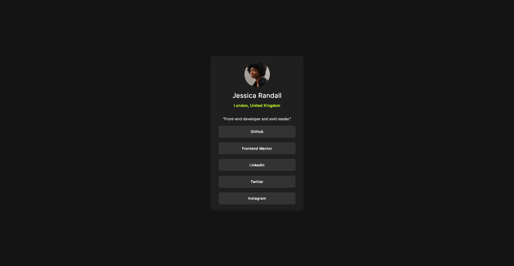

# Frontend Mentor - Social links profile solution

This is a solution to the [Social links profile challenge on Frontend Mentor](https://www.frontendmentor.io/challenges/social-links-profile-UG32l9m6dQ). Frontend Mentor challenges help you improve your coding skills by building realistic projects.

## Table of contents

- [Overview](#overview)
  - [The challenge](#the-challenge)
  - [Screenshot](#screenshot)
  - [Links](#links)
- [My process](#my-process)

  - [Built with](#built-with)
  - [What I learned](#what-i-learned)
  - [Continued development](#continued-development)

- [Author](#author)

**Note: Delete this note and update the table of contents based on what sections you keep.**

## Overview

### The challenge

Users should be able to:

- See hover and focus states for all interactive elements on the page

### Screenshot

### Links

- Solution URL: [Add solution URL here](https://your-solution-url.com)
- Live Site URL: [Add live site URL here](https://your-live-site-url.com)

## My process

### Built with

- Semantic HTML5 markup
- CSS custom properties
- Flexbox
- Font-Face

**Note: These are just examples. Delete this note and replace the list above with your own choices**

### What I learned

I tried to build a solution without look up to design in figma

### Continued development

I want to practice more my analyze skill to build better and similar layout with the design

## Author

- Website - [Andrean](https://portfolio-gamma-three-44.vercel.app/)
- Frontend Mentor - [@imandreans](https://www.frontendmentor.io/profile/imandreans)
- Twitter - [@imandreans](https://www.twitter.com/imandreans)
